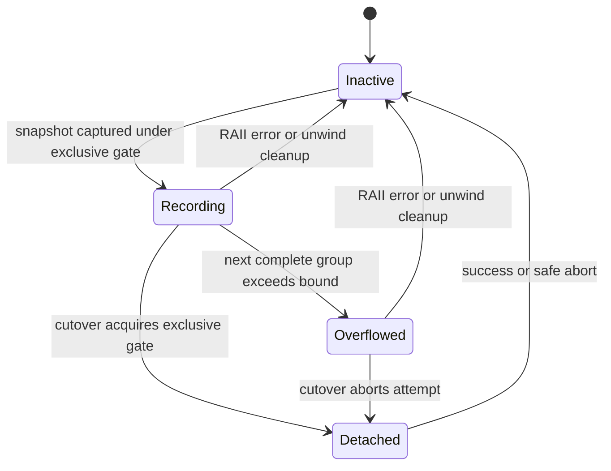

# Data Model: Current-Format Compaction and Windows Physical Durability

This feature adds maintenance state and metadata; it does not change Pigment DB application records or expose a database format version.

## Public value model

### `StoreFamily`

Future-extensible identity of one persisted family: `KeyValue`, `KeySet`, or `KeyMap`. It is ordered in that declaration order for deterministic directory results.

### `FamilyStorageStats`

| Field | Type | Rule |
|-------|------|------|
| `family` | `StoreFamily` | Must match replayed artifact identity. |
| `active_bytes` | `u64` | Exact authoritative active-file length. |
| `sealed_segment_bytes` | `u64` | Checked sum of authoritative sealed-file lengths. |
| `sealed_segment_count` | `usize` | Count of contiguous canonical sealed files. |
| `total_bytes` | `u64` | Checked `active_bytes + sealed_segment_bytes`. |

### `DirectoryStorageStats`

Contains deterministically ordered family statistics and a checked total equal to every family total. An empty valid directory has an empty list and zero total.

### Compaction options

- `ClosedCompactionOptions`: durability policy; default `Buffered`.
- `OnlineCompactionOptions`: maximum encoded concurrent-delta bytes; default `8 * 1024 * 1024`. Zero is valid and permits only an empty delta.

Both are immutable builder values with documented getters and `with_*` methods.

### Compaction results

`CleanupStatus` is `Complete` or `Pending`. `FamilyCompactionOutcome` contains family, exact before/after authoritative bytes, count of removed sealed segments, accepted concurrent logical mutation groups replayed, and cleanup status. Closed compaction always reports zero concurrent mutations. `DirectoryCompactionOutcome` contains deterministic family outcomes; an empty directory returns an empty list.

### Errors and operations

`CompactionOperation` identifies the smallest public operation stage: inspect, capture, staging write/validation, manifest write, previous/replacement publication, replacement reopen, or cleanup. `CompactionError` retains path-specific I/O sources and distinguishes migration guidance, invalid artifacts, ambiguous authority, bounded-delta abort, unsupported durability, and failed-closed state.

## Persistent maintenance model

### `ArtifactDescriptor` (private)

| Field | Rule |
|-------|------|
| relative native path | One normal relative component or a bounded relative path under the manifest anchor; never absolute, `.` or `..`. |
| role | Active, sealed segment, staging, previous-generation entry, or replacement prefix. |
| family | Present for family database artifacts; absent for directory container metadata. |
| length | Exact synchronized length at descriptor creation. |
| checksum | CRC32 over exactly `length` bytes. |

Descriptors must be unique after native-path identity normalization. Counts and encoded lengths are bounded before allocation.

### `CompactionManifest` (private)

| Field | Meaning |
|-------|---------|
| magic/version/body length/checksum | Bounded codec envelope and integrity. |
| operation id | Unique identifier used to bind owned staging and previous artifacts. |
| mode | Closed-directory or online-family; determines whether a `Prepared` source descriptor is immutable or may be an advancing prefix. |
| scope | Directory-level or exactly one family/canonical active name. |
| phase | `Prepared`, `PreviousPublished`, `ReplacementPublished`, or `CleanupPending`. |
| source finalized | False only for online staging; publication cannot begin until an atomic same-phase rewrite freezes the final source inventory. |
| durability | Requested closed policy or inherited online policy. |
| source inventory | Names, roles, families, lengths, checksums for captured/frozen old authority. |
| staging location | Same-parent/same-volume owned location. |
| previous location | Owned location retaining the old complete generation. |
| replacement descriptor | Fully validated replacement inventory, or immutable published prefix for a now-writable online replacement. |

The manifest contains no key, value, set member, sorted-map value, mutation payload, or decoded application data.

### Manifest state transitions

```mermaid
stateDiagram-v2
    [*] --> Prepared: durable manifest publication
    Prepared --> PreviousPublished: old generation safely retained as previous
    PreviousPublished --> ReplacementPublished: validated replacement published canonically
    ReplacementPublished --> CleanupPending: canonical replacement reopened and authority confirmed
    CleanupPending --> [*]: exact cleanup complete; manifest removed last
```

No phase may be skipped in the durable state machine. An initial online `Prepared` descriptor is an immutable verified prefix of the still-authoritative WAL, which may legally append or rotate while staging is built. Rewriting the same phase is allowed only to atomically freeze the final online source inventory and mark it finalized before publication. Recovery of either form of online `Prepared` selects the old canonical WAL. Physical mode synchronizes manifest contents and the namespace transition before the new phase is observable.

### `CapturedGeneration` (private)

An in-memory capture of exact source inventory bytes/descriptors, current replayed family state, family identity, timestamp granularity, and last accepted timestamp bucket. Closed compaction compares both byte inventory and logical state immediately before publication. Online compaction freezes byte inventory only after reacquiring exclusive coordination at cutover.

### `ValidatedReplacement` (private)

Holds staging descriptors and replayed current-V2 state proven equal to the required captured/current state. It is not publishable until content barriers required by the durability policy have succeeded. After online cutover, its immutable initial prefix is retained for cleanup validation while later valid WAL appends/rotations are permitted.

## Volatile coordination model

### `MaintenanceCoordinator` (private, per store)

| Field | Purpose |
|-------|---------|
| `RwLock<()>` gate | Shared across ordinary mutations of this store; exclusive for snapshot activation and cutover. |
| `AtomicBool` attempt active | Immediate rejection of a second online compaction on this instance. |
| backing identity/lease | Present for file stores; binds same-process open registration to store lifetime. |

This structure is constant-size and not shared across unrelated store instances or families.

### `OpenDirectoryRegistry` (private, process-local)

Maps stable directory identity to open-store lease count and an exclusive closed-compaction claim. It coordinates construction/close with closed compaction only; it is never acquired on ordinary read or mutation paths and provides no cross-process exclusion.

### `DeltaRecorder` (private, inside `WalState`)

| Field | Purpose |
|-------|---------|
| attempt token | Prevents one attempt from clearing another recorder. |
| limit | Caller-selected exact encoded-byte bound. |
| used bytes | Checked sum of retained group append sizes. |
| ordered groups | Successfully accepted logical mutations in WAL acceptance order. |
| overflowed | Terminal state for this attempt; mutations continue, payload retention stops. |

`RecordedMutation` contains a timestamp bucket and one or more current-V2 action/payload frames. A compute batch is one group. A group is appended only after durable acceptance succeeds. Exact-limit is valid; exceed/checked-overflow clears groups and enters `overflowed` without rejecting the mutation.

### WAL writer/health state

The writer becomes privately detachable so Windows namespace transitions occur after the old `File` closes. State distinguishes ready, temporarily detached by the owning attempt, and failed closed. Only the matching attempt can reinstall. An authoritative replacement reopen failure and indeterminate publication leave live reads available but mutations fail before I/O until normal reopen recovery.

## Validation invariants

1. Every authoritative current family fully replays as current V2 and matches its canonical family.
2. Every store-directory entry is a canonical database or recognized maintenance artifact; any unexpected entry is rejected byte-for-byte before mutation.
3. Sealed segment ids/bases are contiguous according to current recovery rules; malformed or missing middle segments are never compacted.
4. Stats count only authoritative active/sealed files, never manifests, staging, or previous generations.
5. Every compaction replacement contains one active current-V2 segment per included family and no sealed segments at publication.
6. Logical state, timestamp granularity, and last accepted bucket match across capture, staging validation, cutover, and three reopenings.
7. `PreviousPublished` selects replacement only if its complete validation succeeds; otherwise it restores a verified old generation.
8. No cleanup target is removed unless the manifest owns it and its required descriptor matches.
9. Lock rank is always maintenance before shard before WAL.
10. Reads never acquire maintenance coordination.
11. A second online attempt cannot create artifacts or install a recorder.
12. Physical acknowledgment never precedes required content and namespace barriers.
13. Older recognized formats are classified only; legacy data is never converted by runtime maintenance.
