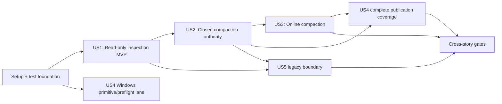

# Tasks: Current-Format Compaction and Windows Physical Durability

**Input**: Design documents from `specs/008-current-compaction-durability/`

**Prerequisites**: `plan.md`, `spec.md`, `research.md`, `data-model.md`, `quickstart.md`, and every contract in `contracts/`

**Tests**: Mandatory. Root `AGENTS.md`, the project constitution, and FR-087 require one behavior-focused runtime RED, the minimum GREEN implementation, and the accumulated relevant suite for every production behavior. Compilation failure is not valid RED. Private test-only seams may be scaffolded before a RED only when the normal library has no new observable behavior; public exposure occurs after the private behavior is GREEN.

**Organization**: Phases 1–2 freeze pre-change evidence and build non-public deterministic test infrastructure. User Story 1 is the independently deliverable inspection MVP. User Story 2 establishes the closed-compaction manifest authority protocol. User Story 3 reuses that protocol for per-store online compaction. User Story 4 promotes Windows physical durability across existing and new publication paths. User Story 5 completes the external-only legacy boundary. The final phase runs cross-story quality and performance gates.

## Format: `[ID] [P?] [Story] Description`

- **[P]** means the task changes or validates different files and has no dependency on an unfinished task in its lane.
- **[Story]** appears only in user-story phases.
- Every task names exact file or artifact paths.

---

## Phase 1: Setup and Immutable Pre-Change Evidence

**Purpose**: Create test roots and freeze the feature-specific performance baseline before any production mutation path changes.

- [X] T001 Create integration test roots and module trees in `tests/maintenance_api.rs`, `tests/storage_inspection.rs`, `tests/storage_inspection/{support,contract,key_value,key_set,key_map,invalid}.rs`, `tests/closed_compaction.rs`, `tests/closed_compaction/{support,contract,key_value,key_set,key_map}.rs`, `tests/compaction_recovery.rs`, `tests/compaction_recovery/{support,phases,faults}.rs`, `tests/online_compaction.rs`, `tests/online_compaction/{support,contract,progress,ordering,failures}.rs`, `tests/windows_physical_durability.rs`, `tests/windows_physical_durability/{contract,preflight,publication,compatibility}.rs`, and `tests/migration_compatibility.rs`
- [X] T002 [P] Create result-free protocol, provenance, baseline, candidate, and final-report templates in `specs/008-current-compaction-durability/benchmarks/{README.md,baseline.md,candidate.md,final.md}` and create `specs/008-current-compaction-durability/benchmarks/{baseline,candidate}/`
- [X] T003 Extend the ignored performance harness with the feature matrix, fixed 32-byte payloads, five warmups, eleven samples, 100 ms/1,024-operation minima, CSV emission, and environment provenance in `tests/mutation_ordering/performance.rs`
- [X] T004 Add and run first-execution-GREEN benchmark-protocol self-tests for cell completeness, median, aggregate p95, source digest, invalid-capture rejection, and threshold inclusivity in `tests/mutation_ordering/performance.rs`
- [X] T005 Smoke-run every feature benchmark cell without recording acceptance results, freeze the harness SHA-256 and pre-feature commit/dirty digest, and document the exact release command, affinity, and dedicated baseline-worktree reconstruction procedure in `specs/008-current-compaction-durability/benchmarks/README.md`
- [X] T006 Pause for quiet-machine confirmation, capture three complete pre-production matrices from the unchanged implementation, and save immutable raw CSV plus commit/dirty/toolchain/OS/CPU/filesystem/affinity metadata in `specs/008-current-compaction-durability/benchmarks/baseline/` and `specs/008-current-compaction-durability/benchmarks/baseline.md`
- [X] T007 [P] Record SHA-256 checksums for every frozen legacy and i128 fixture in `tests/fixtures/legacy/README.md`, `tests/fixtures/i128_key/README.md`, and `specs/008-current-compaction-durability/quickstart.md`
- [X] T008 Run the unchanged debug all-target/all-feature suite, formatting check, and migration fixture suite and record the pre-production GREEN checkpoint in `specs/008-current-compaction-durability/quickstart.md`

**Checkpoint**: Matching baseline evidence is immutable and no production behavior has changed.

---

## Phase 2: Foundational Deterministic Test Infrastructure

**Purpose**: Establish private scheduling, filesystem-fault, subprocess, and traceability seams without exposing maintenance behavior.

**Critical**: This phase may add only test infrastructure and private sentinel seams. It must leave the normal public library behavior unchanged and GREEN.

- [X] T009 Create private maintenance module skeletons, empty registered `cfg(test)` modules, and test-only sentinel entry points without crate-root exports in `src/maintenance.rs`, `src/compaction/{mod,inspection,manifest,publication,recovery,inspection_tests,closed_tests,recovery_tests,online_tests}.rs`, `src/wal/{mod,maintenance_tests}.rs`, and `src/lib.rs`, then prove by source/API scan in `tests/ci_workflow.rs` that a normal build exposes no maintenance symbols
- [X] T010 Add semantic pause/release checkpoints for snapshot capture, recorder activation, staging encode, staging validation, cutover, writer handoff, manifest phases, and cleanup in `src/test_support/maintenance_schedule.rs` and register them only under `cfg(test)` in `src/test_support/mod.rs`
- [X] T011 Add and run checkpoint self-tests proving deterministic block/release, event order, panic unwinding, and zero normal-build hooks in `src/test_support/maintenance_schedule.rs`
- [X] T012 [P] Extend the volatile/durable filesystem model with manifest `.next`, staging, previous, directory/family publication, write-through move, exact cleanup, and power-loss states in `src/test_support/durability_snapshot.rs`
- [X] T013 Add and run filesystem-model self-tests for every `Prepared`, `PreviousPublished`, `ReplacementPublished`, and `CleanupPending` cut plus corrupt/contradictory evidence in `src/test_support/durability_snapshot.rs`
- [X] T014 [P] Add exact native-name, byte snapshot, current-V2 family fixture, segmented fixture, safe-tail fixture, and three-reopen helpers for unit/public tests in `src/test_support/maintenance_fixtures.rs`, `src/test_support/mod.rs`, and `tests/maintenance_support/mod.rs`
- [X] T015 Extend subprocess crash checkpoints with maintenance phase/cut identifiers, child exit verification, and artifact preservation in `src/test_support/fault_checkpoint.rs` and `tests/maintenance_support/mod.rs`
- [X] T016 Add a test-only lock-rank checker for `Maintenance < Shard < WAL` and watchdog diagnostics in `src/test_support/mutation_schedule.rs` and `src/test_support/mod.rs`
- [X] T017 Create an executable FR-001–FR-094 and SC-001–SC-010 test-name coverage manifest in `tests/maintenance_api.rs` without adding public production symbols
- [X] T018 Run all foundational harness self-tests and the existing recovery, durability, mutation-ordering, and migration suites and record the GREEN checkpoint in `specs/008-current-compaction-durability/quickstart.md`

**Checkpoint**: Deterministic infrastructure is ready; public maintenance behavior remains absent.

---

## Phase 3: User Story 1 — Inspect Current Storage Without Mutation (Priority: P1) 🎯 MVP

**Goal**: Expose exact directory and per-open-family storage statistics for valid current-format data without any filesystem or recovery mutation.

**Independent Test**: Inspect empty, active-only, segmented, and mixed-family directories plus one open instance per family; verify exact counts/totals and byte-for-byte identical directory snapshots, while legacy, invalid, and ambiguous evidence returns the specified structured classification.

### RED–GREEN inspection slices

- [X] T019 [US1] Write and run a runtime RED for an empty directory returning no families, zero total, and an unchanged namespace through the private inspection seam in `src/compaction/inspection.rs`
- [X] T020 [US1] Implement only empty-directory discovery and immutable directory opening in `src/compaction/inspection.rs`, then run T019 GREEN
- [X] T021 [US1] Write and run a runtime RED for exact active-only key/value, key/set, key/map, and deterministic family ordering through the private seam in `src/compaction/inspection_tests.rs`
- [X] T022 [US1] Implement canonical active discovery, current-V2 replay validation, and family identity extraction in `src/compaction/inspection.rs` and `src/wal/replay.rs`, then run T021 GREEN
- [X] T023 [US1] Write and run a runtime RED for the single strict-directory behavior: contiguous sealed segments produce exact active/sealed/count/total bytes, while any unexpected entry rejects inspection and leaves the directory byte-identical in `src/compaction/inspection_tests.rs`
- [X] T024 [US1] Implement strict sealed-name parsing, continuity checks, and descriptor aggregation in `src/compaction/inspection.rs` and `src/wal/recovery.rs`, then run T023 GREEN
- [X] T025 [US1] Write and run one table-driven runtime RED for the single invalid-artifact classification behavior across malformed segment names, missing leading/middle segments, wrong-family canonical artifacts, corrupt headers/records, and unknown entries in `src/compaction/inspection_tests.rs`
- [X] T026 [US1] Implement only the strict canonical namespace and current-record validation needed for T025 in `src/compaction/inspection.rs`, then run T025 GREEN and T021–T024
- [X] T027 [US1] Write and run a runtime RED proving a normally recoverable terminal current-V2 tail is classified and measured without repair, truncate, rename, create, or sync in `src/compaction/inspection_tests.rs`
- [X] T028 [US1] Factor a read-only accepted-prefix replay/classification path without invoking normal recovery mutation in `src/wal/replay.rs` and `src/compaction/inspection.rs`, then run T027 GREEN
- [X] T029 [US1] Write and run a runtime RED proving every recognized older envelope returns the affected path and `pigment-db-migrate` guidance without decoding application data in `src/compaction/inspection_tests.rs`
- [X] T030 [US1] Implement a bounded shallow legacy-envelope classifier shared with runtime recovery but not migration conversion in `src/compaction/inspection.rs` and `src/recovery.rs`, then run T029 GREEN
- [X] T031 [US1] Write and run a runtime RED distinguishing ambiguous complete maintenance generations from invalid non-competing debris while preserving every byte in `src/compaction/inspection_tests.rs`
- [X] T032 [US1] Implement read-only maintenance-evidence classification and exact relevant-path collection in `src/compaction/inspection.rs` and `src/compaction/recovery.rs`, then run T031 GREEN
- [X] T033 [US1] Add and run synthetic boundary characterization for checked per-family and directory arithmetic overflow in `src/compaction/inspection.rs`; record first-execution GREEN because earlier exact-byte slices had already introduced the required checked additions
- [X] T034 [US1] Extract the already-GREEN checked byte aggregation and deterministic result construction in `src/compaction/inspection.rs`, then run T033 and the accumulated inspection suite GREEN
- [X] T035 [US1] Write and run a runtime RED proving private adapters for each open file-backed store report only their family/current generation and do not run recovery or count maintenance/previous artifacts in `src/compaction/inspection_tests.rs`
- [X] T036 [US1] Retain immutable file-backing identity in all file constructors and add private per-family statistics adapters in `src/key_value_store.rs`, `src/key_set_store.rs`, `src/key_map_store.rs`, and `src/maintenance.rs`, then run T035 GREEN

### Public US1 promotion and checkpoint

- [X] T037 [US1] Promote the already-GREEN family/statistics value model, common operation/error source/display chains, documented getters, and future-extensible types in `src/maintenance.rs` and crate-root exports in `src/lib.rs`, with first-execution-GREEN contract assertions in `tests/maintenance_api.rs`
- [X] T038 [US1] Promote `inspect_storage` plus three file-backed `storage_stats` methods over GREEN private behavior in `src/maintenance.rs`, `src/key_value_store.rs`, `src/key_set_store.rs`, and `src/key_map_store.rs`, then run first public executions GREEN in `tests/storage_inspection/contract.rs`
- [X] T039 [US1] Add first-execution-GREEN public integration matrices for every valid, legacy, invalid, unexpected, and ambiguous US1 fixture plus deterministic ordering, non-exhaustive matching, file-only specialization, error guidance/source, `Send`/`Sync`, and no-format-version assertions in `tests/maintenance_api.rs` and `tests/storage_inspection/{contract,key_value,key_set,key_map,invalid}.rs`
- [X] T040 [US1] Run the complete US1 suite and re-run every fixture with before/after native-name, metadata, and byte snapshots; record SC-001 and the US1 GREEN checkpoint in `specs/008-current-compaction-durability/quickstart.md`

**Checkpoint**: Storage inspection is independently usable and never mutates storage.

---

## Phase 4: User Story 2 — Compact a Closed Database In Place (Priority: P1)

**Goal**: Compact an unopened current-format directory to one active V2 segment per family through an interruption-recoverable publication protocol.

**Independent Test**: Compact segmented mixed-family storage, verify exact public logical/timestamp state and one active segment through three reopenings, reject every source change, recover at every phase cut, report pending cleanup correctly, and repeat safely.

### Same-process ownership and empty operation

- [X] T041 [US2] Write and run a runtime RED proving a same-process open store or racing open attempt causes the private closed seam to fail before any artifact creation while another directory remains independent in `src/compaction/closed_tests.rs`
- [X] T042 [US2] Implement canonical directory identities, RAII open leases, and atomic exclusive closed claims in `src/maintenance_coordination.rs` and all file constructors in `src/key_value_store.rs`, `src/key_set_store.rs`, and `src/key_map_store.rs`, then run T041 GREEN
- [X] T043 [US2] Write and run a runtime RED proving private closed compaction of an empty directory is a zero-outcome, artifact-free no-op in `src/compaction/closed_tests.rs`
- [X] T044 [US2] Implement only the private closed-compaction entry, ownership check, prior-authority inspection, and empty no-op in `src/maintenance.rs` and `src/compaction/mod.rs`, then run T043 GREEN

### Current-V2 replacement encoding

- [X] T045 [US2] Write and run a runtime RED for deterministic key/value current-V2 snapshot encoding with one active segment and exact replayed state in `src/wal/maintenance_tests.rs`
- [X] T046 [US2] Implement the minimum sorted key/value current-V2 snapshot encoder in `src/wal/replay.rs`, then run T045 GREEN
- [X] T047 [US2] Write and run a runtime RED for deterministic key/set current-V2 snapshot encoding with exact set membership in `src/wal/maintenance_tests.rs`
- [X] T048 [US2] Extend the GREEN current-V2 encoder for key/set groups in `src/wal/replay.rs`, then run T047 GREEN and T045
- [X] T049 [US2] Write and run a runtime RED for deterministic key/map current-V2 snapshot encoding with exact sorted-map keys/values in `src/wal/maintenance_tests.rs`
- [X] T050 [US2] Extend the GREEN current-V2 encoder for key/map groups without historical encoders in `src/wal/replay.rs`, then run T049 GREEN and T045–T048
- [X] T051 [US2] Write and run a runtime RED proving all snapshot encoders preserve family identity, timestamp granularity, last accepted bucket, checked offsets, and current V2 framing in `src/wal/maintenance_tests.rs`
- [X] T052 [US2] Factor neutral current-V2 header/frame helpers shared by migration output and compaction without calling migration probes in `src/wal/replay.rs`, `src/wal/format.rs`, and `src/migration.rs`, then run T051 GREEN and frozen migration tests

### Manifest codec and atomic phase publication

- [X] T053 [US2] Write and run a runtime RED for manifest roundtrip, magic/version/body bounds, CRC32 corruption, every scope/phase/policy, and proof no application payload is encoded in `src/compaction/manifest.rs`
- [X] T054 [US2] Implement the bounded custom-binary manifest envelope and private entities in `src/compaction/manifest.rs`, then run T053 GREEN
- [X] T055 [US2] Write and run a runtime RED rejecting absolute/parent/alias/duplicate paths, excessive counts/lengths, unknown enum values, and descriptor escape in `src/compaction/manifest.rs`
- [X] T056 [US2] Implement native relative-path validation, allocation limits, descriptor uniqueness, and exact checksum verification in `src/compaction/manifest.rs`, then run T055 GREEN and T053
- [X] T057 [US2] Write and run a runtime RED for buffered atomic `.manifest.next` write/flush/rename, main-manifest precedence, failed temp publication, and no phase advance in `src/compaction/manifest.rs`
- [X] T058 [US2] Implement buffered atomic manifest publication and same-parent native artifact naming in `src/compaction/manifest.rs` and `src/compaction/publication.rs`, then run T057 GREEN

### Closed staging, validation, and source stability

- [X] T059 [US2] Write and run a runtime RED for capturing all discovered families and constructing a unique same-parent staging directory with one V2 active file per family while source stays authoritative in `src/compaction/closed_tests.rs`
- [X] T060 [US2] Implement exact source capture, staged directory construction, and requested content synchronization in `src/compaction/mod.rs` and `src/compaction/publication.rs`, then run T059 GREEN
- [X] T061 [US2] Write and run a runtime RED proving staging reopen/family/state/timestamp mismatch rejects publication and preserves the exact source in `src/compaction/closed_tests.rs`
- [X] T062 [US2] Implement complete staging reopen and public-state/metadata comparison in `src/compaction/mod.rs` and `src/compaction/inspection.rs`, then run T061 GREEN
- [X] T063 [US2] Write and run one table-driven runtime RED for the single exact-source-stability behavior across additions, removals, renames, and length changes between capture and publication in `src/compaction/closed_tests.rs`
- [X] T064 [US2] Implement final native inventory and length reread before publication in `src/compaction/mod.rs`, then run T063 GREEN
- [X] T065 [US2] Write and run a runtime RED for same-length source-byte replacement after capture in `src/compaction/closed_tests.rs`
- [X] T066 [US2] Add exact source checksums/byte comparison to the final stability gate in `src/compaction/mod.rs` and `src/compaction/inspection.rs`, then run T065 GREEN and T063

### Authority publication and cleanup

- [X] T067 [US2] Write and run a runtime RED proving `Prepared` retains old authority and old-to-previous publication completes before `PreviousPublished` without deleting source evidence in `src/compaction/recovery_tests.rs`
- [X] T068 [US2] Implement `Prepared` and old-to-previous transitions with the last complete authority retained in `src/compaction/publication.rs`, then run T067 GREEN
- [X] T069 [US2] Write and run a runtime RED proving only a validated staging generation becomes canonical before `ReplacementPublished` and canonical replacement reopens before authority confirmation in `src/compaction/recovery_tests.rs`
- [X] T070 [US2] Implement replacement publication, canonical reopen, and `ReplacementPublished` transition in `src/compaction/publication.rs`, then run T069 GREEN
- [X] T071 [US2] Write and run a runtime RED proving cleanup starts only after `CleanupPending`, deletes exact owned matches, removes the manifest last, and reports `Pending` on any cleanup fault in `src/compaction/recovery_tests.rs`
- [X] T072 [US2] Implement phase-ordered exact cleanup and pending outcomes in `src/compaction/publication.rs` and `src/compaction/recovery.rs`, then run T071 GREEN

### Interrupted compaction recovery

- [X] T073 [US2] Write and run a runtime RED for `Prepared` recovery restoring split old artifacts, accepting online-prefix advancement rules only in online mode, and discarding only provably incomplete owned staging in `src/compaction/recovery_tests.rs`
- [X] T074 [US2] Implement idempotent `Prepared` recovery in `src/compaction/recovery.rs`, then run T073 GREEN
- [X] T075 [US2] Write and run a runtime RED for `PreviousPublished` preferring a fully validated replacement, otherwise restoring verified previous, otherwise preserving evidence with `AuthorityUndetermined` in `src/compaction/recovery_tests.rs`
- [X] T076 [US2] Implement the evidence-driven `PreviousPublished` decision in `src/compaction/recovery.rs`, then run T075 GREEN
- [X] T077 [US2] Write and run a runtime RED for `ReplacementPublished` selecting only a validated canonical replacement while retaining previous evidence until confirmation in `src/compaction/recovery_tests.rs`
- [X] T078 [US2] Implement `ReplacementPublished` validation and authority confirmation in `src/compaction/recovery.rs`, then run T077 GREEN
- [X] T079 [US2] Write and run a runtime RED for `CleanupPending` replacement-prefix validation, missing-target idempotence, mismatching-target preservation, and safe repeated retry in `src/compaction/recovery_tests.rs`
- [X] T080 [US2] Implement exact/prefix cleanup recovery and manifest-last convergence in `src/compaction/recovery.rs`, then run T079 GREEN
- [X] T081 [US2] Write and run a runtime RED classifying missing/corrupt/contradictory manifests as `AuthorityUndetermined` only when competing authority cannot be resolved and otherwise `InvalidArtifact` in `src/compaction/recovery_tests.rs`
- [X] T082 [US2] Implement fail-closed manifestless evidence classification without mutation in `src/compaction/recovery.rs`, then run T081 GREEN
- [X] T083 [US2] Write and run a runtime RED proving all three file-store initializers resolve maintenance before ordinary WAL recovery and preserve evidence on failure in `tests/compaction_recovery/contract.rs`
- [X] T084 [US2] Invoke maintenance recovery before normal WAL recovery in `src/key_value_store.rs`, `src/key_set_store.rs`, `src/key_map_store.rs`, and `src/wal/recovery.rs`, then run T083 GREEN and existing recovery suites
- [X] T085 [US2] Run the expected-GREEN private fault-model matrix for every staging create/write/sync/validate, manifest write/sync, previous/replacement move, reopen, phase rewrite, and cleanup cut across all families and modeled buffered/physical policies in `src/compaction/recovery_tests.rs`
- [X] T086 [US2] Run the expected-GREEN subprocess termination/reopen matrix at every T085 cut, asserting only public reopen state/errors and artifact snapshots in `tests/compaction_recovery/{phases,faults}.rs` via `src/test_support/fault_checkpoint.rs`; any newly exposed behavior gap must receive its own RED–GREEN pair before continuing

### Public US2 promotion and checkpoint

- [X] T087 [US2] Promote `compact_directory_in_place`, buffered-default/physical-builder closed options, directory/family outcomes, operation-specific I/O paths, and cleanup status over GREEN private behavior in `src/maintenance.rs` and `src/lib.rs`, with first public executions GREEN in `tests/closed_compaction/contract.rs`
- [X] T088 [US2] Add public all-family, active-only, segmented, safe-tail, mixed-directory, repeated-compaction, cleanup-retry, exact timestamp, and three-reopen acceptance coverage under buffered and supported physical policies in `tests/closed_compaction/{key_value,key_set,key_map,contract}.rs`
- [X] T089 [US2] Run the complete US2, crash/reopen, existing recovery, migration, buffered/physical model, and same-process ownership suites and record SC-002/SC-003 GREEN evidence in `specs/008-current-compaction-durability/quickstart.md`

**Checkpoint**: Closed compaction and interruption recovery are independently production-ready.

---

## Phase 5: User Story 3 — Compact an Open Store While Work Continues (Priority: P1)

**Goal**: Compact one open family while reads remain direct, writes progress during staging, and accepted concurrent mutations replay exactly once in WAL acceptance order.

**Independent Test**: Pause staging after a consistent snapshot, complete ordered same-key/distinct-key/compute/remove/recreate mutations, cut over, mutate and rotate immediately, and verify exact live/reopened state through three reopenings; overflow and every failure retain the specified writable or failed-closed authority.

### Per-store coordination and mutation participation

- [ ] T090 [US3] Write and run a runtime RED for one constant-size per-store gate, one attempt flag, immediate same-instance exclusion, and unrelated-instance/family independence in `src/compaction/online_tests.rs`
- [ ] T091 [US3] Implement `MaintenanceCoordinator`, attempt token, poison recovery, and generic store runtime fields without a directory/global mutation gate in `src/maintenance_coordination.rs`, `src/key_value_store.rs`, `src/key_set_store.rs`, and `src/key_map_store.rs`, then run T090 GREEN
- [ ] T092 [US3] Write and run a runtime RED proving every key/value mutation acquires `Maintenance -> Shard -> WAL` and retains shared maintenance through live publication in `src/mutation_ordering_tests/key_value.rs`
- [ ] T093 [US3] Prefix all key/value fallible mutation cores with the shared gate and release it before callbacks in `src/key_value_store.rs`, then run T092 GREEN and key/value compatibility tests
- [ ] T094 [US3] Write and run a runtime RED proving key/set ordinary and compute acceptance follows the lock order while async user work/cancellation occurs outside maintenance coordination in `src/mutation_ordering_tests/key_set.rs`
- [ ] T095 [US3] Integrate shared maintenance across key/set mutation cores and post-await conflict acceptance without holding it across user futures in `src/key_set_store.rs`, then run T094 GREEN and async conflict tests
- [ ] T096 [US3] Write and run a runtime RED proving key/map ordinary, ordered, pop, removal, callback, and compute paths follow the lock order through publication in `src/mutation_ordering_tests/key_map.rs`
- [ ] T097 [US3] Integrate shared maintenance across every key/map mutation core and release before callback/result delivery in `src/key_map_store.rs`, then run T096 GREEN
- [ ] T098 [US3] Write and run a runtime RED proving all normal reads bypass maintenance and reentrant callbacks execute after maintenance/shard guards drop in `src/compaction/online_tests.rs`
- [ ] T099 [US3] Narrow guard scopes and preserve direct DashMap reads/callback reentrancy in `src/key_value_store.rs`, `src/key_set_store.rs`, and `src/key_map_store.rs`, then run T098 GREEN
- [ ] T100 [US3] Extend the executable mutator traceability test to RED on every missing maintenance-participation path in `tests/mutation_ordering/traceability.rs`
- [ ] T101 [US3] Complete the maintenance participation map for every public mutator in `src/key_value_store.rs`, `src/key_set_store.rs`, and `src/key_map_store.rs`, then run T100 GREEN and the accumulated mutation-ordering suite

### WAL-ordered bounded delta

- [ ] T102 [US3] Write and run a runtime RED for token-bound recorder activation/detach, exact-limit acceptance, first-group-over-limit clearing, checked overflow, later-work skipping, and bounded memory in `src/wal/maintenance_tests.rs`
- [ ] T103 [US3] Implement private `DeltaRecorder`, grouped logical frames, exact V2 encoded-length accounting, and overflow state inside `WalState` in `src/wal/mod.rs`, then run T102 GREEN
- [ ] T104 [US3] Write and run a runtime RED proving successful single actions enter the delta only after write/flush/physical barrier and in cross-shard WAL acceptance order in `src/wal/maintenance_tests.rs`
- [ ] T105 [US3] Record already-encoded successful single actions at the acceptance boundary with an allocation-free inactive branch in `src/wal/mod.rs`, then run T104 GREEN
- [ ] T106 [US3] Write and run a runtime RED proving every multi-frame compute acceptance is one atomic ordered delta group with its accepted timestamp bucket in `src/wal/maintenance_tests.rs`
- [ ] T107 [US3] Record complete compute batches only after durable acceptance in `src/wal/mod.rs`, then run T106 GREEN and compute persistence suites
- [ ] T108 [US3] Write and run a runtime RED proving rejected writes, failed flush/sync, successful rollback, failed rollback, conflicts, and no-op compute never enter the delta and unhealthy WAL aborts cutover in `src/wal/maintenance_tests.rs`
- [ ] T109 [US3] Restrict recorder success exits and propagate failed-closed WAL health to maintenance in `src/wal/mod.rs`, then run T108 GREEN
- [ ] T110 [US3] Write and run a runtime RED proving async conflict, dropped future, callback panic, and cancellation create no delta group and promptly release coordination in `src/compaction/online_tests.rs`
- [ ] T111 [US3] Preserve pre-acceptance async/panic exits and token-safe cleanup in `src/key_set_store.rs` and `src/maintenance_coordination.rs`, then run T110 GREEN

### Snapshot, staging, and cutover

- [ ] T112 [US3] Write and run a runtime RED proving one exclusive interval captures consistent state/metadata, activates exactly one recorder, and durably writes initial online `Prepared` without a mutation gap in `src/compaction/online_tests.rs`
- [ ] T113 [US3] Implement initial online capture, recorder activation, verified-prefix manifest, and exclusive release in `src/compaction/mod.rs` and `src/compaction/manifest.rs`, then run T112 GREEN
- [ ] T114 [US3] Write and run a runtime RED proving online `Prepared` accepts valid old-WAL appends/rotation during staging, recovery selects old authority, and publication requires `source_finalized = true` in `src/compaction/online_tests.rs`
- [ ] T115 [US3] Implement online mode/prefix validation and atomic finalized same-phase rewrite rules in `src/compaction/manifest.rs` and `src/compaction/recovery.rs`, then run T114 GREEN
- [ ] T116 [US3] Write and run one deterministic runtime RED for the single out-of-gate staging behavior, proving reads and writes complete while encoding/validation checkpoints are paused and exclusive maintenance records zero staging operations in `src/compaction/online_tests.rs`
- [ ] T117 [US3] Encode, synchronize, reopen, and validate current-V2 staging strictly outside exclusive maintenance in `src/compaction/mod.rs` and `src/wal/replay.rs`, then run T116 GREEN
- [ ] T118 [US3] Write and run a runtime RED for same-key, distinct-key, put/remove, and delete/recreate accepted deltas replaying exactly once in WAL order in `src/compaction/online_tests.rs`
- [ ] T119 [US3] Implement ordered single-action delta application with regenerated current-V2 framing in `src/compaction/mod.rs` and `src/wal/replay.rs`, then run T118 GREEN
- [ ] T120 [US3] Write and run a runtime RED for compute/ordinary overlap, atomic multi-change batches, accepted timestamps, and final last-bucket continuity in `src/compaction/online_tests.rs`
- [ ] T121 [US3] Implement atomic grouped delta replay and timestamp continuity in `src/compaction/mod.rs` and `src/wal/replay.rs`, then run T120 GREEN
- [ ] T122 [US3] Write and run a runtime RED proving cutover reopens staging and compares exact current live state/family/granularity/bucket before any namespace publication in `src/compaction/online_tests.rs`
- [ ] T123 [US3] Implement exclusive final-state capture and exact pre-publication validation in `src/compaction/mod.rs`, then run T122 GREEN
- [ ] T124 [US3] Write and run one table-driven runtime RED for the single bounded-delta contract at zero, exact, and one-group-over limits, proving overflow aborts at cutover while the original WAL and later mutations remain writable/recoverable in `src/compaction/online_tests.rs`
- [ ] T125 [US3] Implement overflow staging abandonment and original-authority preservation through phase-aware cleanup in `src/compaction/mod.rs` and `src/compaction/recovery.rs`, then run T124 GREEN

### Writer handoff and failure semantics

- [ ] T126 [US3] Write and run a runtime RED proving the active writer is detach-token protected, old handles close before namespace publication, and pre-publication failure reinstalls only a proven old writer in `src/wal/maintenance_tests.rs`
- [ ] T127 [US3] Make the private WAL writer detachable and add health-checked take/reinstall seams in `src/wal/mod.rs`, then run T126 GREEN and existing durability tests
- [ ] T128 [US3] Write and run a runtime RED proving successful cutover installs replacement offset/buffer/granularity/bucket/rotation state and an immediate mutation plus forced rotation targets only replacement in `src/compaction/online_tests.rs`
- [ ] T129 [US3] Implement writer and rotation-state handoff after shared manifest publication in `src/wal/mod.rs`, `src/compaction/mod.rs`, and `src/compaction/publication.rs`, then run T128 GREEN
- [ ] T130 [US3] Write and run a runtime RED proving a paused first compaction permits reads/writes while a second same-instance private call fails immediately without artifacts or recorder replacement in `src/compaction/online_tests.rs`
- [ ] T131 [US3] Move attempt compare/exchange before artifact work and bind all recorder/artifact ownership to the winning token in `src/maintenance_coordination.rs` and `src/compaction/mod.rs`, then run T130 GREEN
- [ ] T132 [US3] Write and run a runtime RED proving staging create/write/sync/reopen/mismatch failures leave the original writer authoritative and clear attempt/recorder state in `src/compaction/online_tests.rs`
- [ ] T133 [US3] Implement pre-publication RAII cleanup for only invocation-owned staging in `src/maintenance_coordination.rs` and `src/compaction/mod.rs`, then run T132 GREEN
- [ ] T134 [US3] Write and run a runtime RED proving indeterminate namespace authority preserves readable live state/evidence and rejects every later mutation before I/O until reopen in `src/compaction/online_tests.rs`
- [ ] T135 [US3] Extend internal WAL health for maintenance indeterminacy and replacement-reopen failure in `src/wal/mod.rs` and `src/compaction/mod.rs`, then run T134 GREEN
- [ ] T136 [US3] Write and run a runtime RED proving post-publication cleanup failure reports pending while replacement stays readable/writable and cleanup converges on reopen or next explicit compaction in `src/compaction/online_tests.rs`
- [ ] T137 [US3] Implement replacement-prefix validation and foreground cleanup retry without background scheduling in `src/compaction/recovery.rs`, `src/compaction/mod.rs`, and all file-store initializers, then run T136 GREEN
- [ ] T138 [US3] Write and run a runtime RED proving panic/unwind/cancellation at every pre-publication checkpoint clears only the matching recorder and resets the attempt flag after lock guards drop in `src/compaction/online_tests.rs`
- [ ] T139 [US3] Implement token-safe `OnlineAttemptGuard` and phase-aware `StagingGenerationGuard` drop behavior in `src/maintenance_coordination.rs`, then run T138 GREEN

### Public US3 promotion and checkpoint

- [ ] T140 [US3] Promote 8-MiB-default/`with_max_delta_bytes` `OnlineCompactionOptions` and three file-backed `try_compact_online` methods that inherit opened durability over GREEN private behavior in `src/maintenance.rs`, `src/key_value_store.rs`, `src/key_set_store.rs`, `src/key_map_store.rs`, and `src/lib.rs`, with first public executions GREEN in `tests/online_compaction/contract.rs`
- [ ] T141 [P] [US3] Run the complete public progress/ordering/failure matrix and exact three-reopen assertions for all families in `tests/online_compaction/{progress,ordering,failures,contract}.rs`
- [ ] T142 [P] [US3] Run lock-rank, watchdog deadlock, inactive-recorder allocation, direct-read bypass, callback release, and unrelated-instance structural tests in `src/compaction/online_tests.rs`, `src/wal/maintenance_tests.rs`, and `tests/mutation_ordering/traceability.rs`
- [ ] T143 [US3] Run all US3 plus existing mutation-ordering, compute, durability, recovery, rotation, and async suites and record SC-004–SC-006 GREEN evidence in `specs/008-current-compaction-durability/quickstart.md`

**Checkpoint**: Online compaction is independently callable, bounded, concurrent during staging, and authority-safe.

---

## Phase 6: User Story 4 — Request Physical Durability on Windows (Priority: P1)

**Goal**: Support explicit Windows physical durability through proven file-content and write-through namespace barriers without fallback.

**Independent Test**: On Windows, construct/open/mutate/rotate/recover/compact every family under physical policy, inject every content and write-through failure, and verify durable acknowledged state or structured pre-exposure refusal; Unicode, supported long paths, sharing conflicts, and buffered compatibility all behave exactly.

### Bounded Windows platform boundary

- [ ] T144 [US4] Add target-specific `windows-sys = 0.61.2` with only `Win32_Storage_FileSystem`, create a private safe namespace stub, and establish crate-wide unsafe denial with the sole module exception in `Cargo.toml`, `Cargo.lock`, `src/lib.rs`, `src/durability.rs`, and `src/durability/windows.rs` without changing public support behavior
- [ ] T145 [US4] Write and run a Windows runtime RED for lossless Unicode/supported-long-path UTF-16 conversion, exact terminator lifetime, and interior-NUL rejection through the private safe seam in `src/durability/windows.rs`
- [ ] T146 [US4] Implement the documented native path conversion and safety invariants inside `src/durability/windows.rs`, then run T145 GREEN
- [ ] T147 [US4] Write and run a Windows runtime RED for no-replace and replace-existing `MoveFileExW` flag sets, same-volume behavior, destination conflict, and immediate original `last_os_error` preservation in `src/durability/windows.rs`
- [ ] T148 [US4] Implement the sole unsafe `MoveFileExW` wrapper using `MOVEFILE_WRITE_THROUGH`, optional `MOVEFILE_REPLACE_EXISTING`, and never `MOVEFILE_COPY_ALLOWED` in `src/durability/windows.rs`, then run T147 GREEN

### Actual-filesystem preflight

- [ ] T149 [US4] Write and run a Windows runtime RED requiring disposable sentinel write/flush/`sync_all`/reopen validation on the actual target directory before store exposure in `tests/windows_physical_durability/preflight.rs`
- [ ] T150 [US4] Implement actual-directory file-content preflight without authoritative artifact access in `src/durability.rs` and `src/durability/windows.rs`, then run T149 GREEN
- [ ] T151 [US4] Write and run a Windows runtime RED requiring same-directory no-replace write-through move, replace probe, content validation, and identity-safe disposable cleanup in `tests/windows_physical_durability/preflight.rs`
- [ ] T152 [US4] Implement unique `create_new` namespace preflight and safe cleanup in `src/durability/windows.rs`, then run T151 GREEN
- [ ] T153 [US4] Write and run one table-driven Windows runtime RED for the single preflight-failure contract across content, namespace, and cleanup failures, requiring the correct `RequiredBarrierUnavailable`, original OS source, no fallback, no authority mutation, and no exposed store in `tests/windows_physical_durability/preflight.rs`
- [ ] T154 [US4] Replace Windows `UnsupportedPlatform` with ordered content/namespace capability gating and exact structured mapping in `src/durability.rs` and `src/wal/recovery.rs`, then run T153 GREEN and non-Windows capability tests

### Write-through publication coverage

- [ ] T155 [US4] Write and run a Windows runtime RED proving fresh physical creation for all families uses synchronized staging then no-replace write-through publication before exposure in `tests/windows_physical_durability/publication.rs`
- [ ] T156 [US4] Route fresh-store physical publication through the platform namespace abstraction in `src/wal/recovery.rs` and `src/durability.rs`, then run T155 GREEN
- [ ] T157 [US4] Write and run a Windows runtime RED proving rotation closes/replaces the active handle and uses write-through sealing/next-active publication without weakening segment authority in `tests/windows_physical_durability/publication.rs`
- [ ] T158 [US4] Route physical rotation transitions through handle-safe write-through operations in `src/wal/mod.rs` and `src/durability.rs`, then run T157 GREEN
- [ ] T159 [US4] Write and run a Windows runtime RED proving normal recovery repair/promotion/rollback uses file synchronization plus write-through namespace transitions in `tests/windows_physical_durability/publication.rs`
- [ ] T160 [US4] Route physical recovery publication through the platform abstraction in `src/wal/recovery.rs` and `src/durability.rs`, then run T159 GREEN
- [ ] T161 [US4] Write and run a Windows runtime RED proving manifest revisions, source-to-previous, closed staging-to-canonical, and cleanup authority transitions use the correct no-replace/replace write-through mode in `tests/windows_physical_durability/publication.rs`
- [ ] T162 [US4] Route physical closed-compaction and manifest publication through write-through operations in `src/compaction/manifest.rs`, `src/compaction/publication.rs`, and `src/durability.rs`, then run T161 GREEN
- [ ] T163 [US4] Write and run a Windows runtime RED proving online cutover drops the old handle, moves family artifacts write-through, reopens canonical replacement, and installs the new writer before writes resume in `tests/windows_physical_durability/publication.rs`
- [ ] T164 [US4] Route physical online cutover and writer handoff through the Windows-safe publication path in `src/compaction/publication.rs`, `src/compaction/mod.rs`, and `src/wal/mod.rs`, then run T163 GREEN

### Failure, compatibility, and CI evidence

- [ ] T165 [US4] Write and run one table-driven Windows runtime RED for the single physical-publication failure contract across fresh, rotation, recovery, manifest, previous, replacement, reopen, and cleanup boundaries in `tests/windows_physical_durability/publication.rs`
- [ ] T166 [US4] Preserve rollback/failed-closed authority and exact operation/path/OS sources for every T165 failure in `src/durability.rs`, `src/wal/recovery.rs`, and `src/compaction/{manifest,publication,recovery}.rs`, then run T165 GREEN
- [ ] T167 [US4] Write and run one table-driven Windows runtime RED for the single native-path/handle contract across Unicode paths, supported long absolute paths, destination-exists no-replace, and an external non-delete-sharing handle conflict with zero fallback in `tests/windows_physical_durability/contract.rs`
- [ ] T168 [US4] Correct only remaining path/handle/error propagation defects inside `src/durability/windows.rs`, `src/wal/mod.rs`, and `src/compaction/publication.rs`, then run T167 GREEN
- [ ] T169 [US4] Write and run a Windows buffered first-execution-GREEN compatibility test proving established bytes/results and zero Win32 write-through calls in `tests/windows_physical_durability/compatibility.rs`
- [ ] T170 [US4] Keep buffered dispatch on standard-library namespace operations and Linux/macOS physical rename-plus-directory-sync behavior unchanged in `src/durability.rs`, then rerun T169 and existing durability suites GREEN
- [ ] T171 [P] [US4] Run public physical construction/open, ordinary mutation, compute batch, rollback, rotation, recovery, and three-reopen matrices for every family in `tests/windows_physical_durability/contract.rs`
- [ ] T172 [P] [US4] Run closed/online compaction and every manifest/cleanup cut under real and fault-modeled Windows physical policy in `tests/windows_physical_durability/publication.rs`
- [ ] T173 [US4] Replace Windows physical-unsupported CI assertions with the full support matrix and unsafe-boundary scan in `.github/workflows/recovery.yml`, `tests/durable_write_policy/contract.rs`, and `src/wal/durability_tests.rs`
- [ ] T174 [US4] Run the Windows matrix plus Linux/macOS compatibility jobs and record SC-008/SC-010 platform evidence in `specs/008-current-compaction-durability/quickstart.md`

**Checkpoint**: Windows physical durability is explicit, preflighted, write-through, and never silently downgraded.

---

## Phase 7: User Story 5 — Keep Legacy Conversion Explicit (Priority: P2)

**Goal**: Ensure runtime open, inspection, and compaction classify older data with external-tool guidance while all legacy decoding/conversion and frozen fixtures remain isolated in `pigment-db-migrate`.

**Independent Test**: Present every frozen recognized older fixture to runtime open, inspection, and closed compaction; assert `MigrationRequired`, exact path/tool guidance, no namespace/byte change, no public format-version API, and unchanged migration CLI output/checksums.

- [ ] T175 [US5] Write and run a runtime RED exercising every recognized older key/value, key/set, and key/map fixture through runtime open, inspection, and closed compaction with exact path/tool guidance in `tests/migration_compatibility.rs`
- [ ] T176 [US5] Keep application-data decoding exclusively in `src/migration.rs` and route runtime entry points in `src/recovery.rs`, `src/compaction/inspection.rs`, and `src/maintenance.rs` through only the bounded shallow classifier, then run T175 GREEN
- [ ] T177 [US5] Write and run a runtime RED proving every legacy rejection creates, repairs, renames, truncates, synchronizes, deletes, or stages zero artifacts in `tests/migration_compatibility.rs`
- [ ] T178 [US5] Move classification before every maintenance mutation boundary and remove any runtime conversion call path in `src/compaction/mod.rs` and `src/compaction/recovery.rs`, then run T177 GREEN
- [ ] T179 [US5] Write and run a runtime RED distinguishing corrupt/wrong-family/malformed current data from genuinely ambiguous old/staging/replacement evidence across open, inspect, and compact in `tests/migration_compatibility.rs`
- [ ] T180 [US5] Unify structured `MigrationRequired`, `InvalidArtifact`, and `AuthorityUndetermined` mapping without exposing internal versions in `src/recovery.rs`, `src/maintenance.rs`, and `src/compaction/recovery.rs`, then run T179 GREEN
- [ ] T181 [P] [US5] Verify frozen legacy/i128 fixture SHA-256 values remain unchanged and record before/after hashes in `tests/fixtures/legacy/README.md`, `tests/fixtures/i128_key/README.md`, and `specs/008-current-compaction-durability/quickstart.md`
- [ ] T182 [US5] Run the complete external `pigment-db-migrate` contract, compatibility, failure, process, and i128 suites unchanged in `tests/migration_cli/` and record first-execution-GREEN outcomes in `specs/008-current-compaction-durability/quickstart.md`
- [ ] T183 [P] [US5] Add compile/rustdoc contract assertions that no public format-version enum, implicit migration option, or background compaction scheduler exists in `tests/maintenance_api.rs` and `src/lib.rs`
- [ ] T184 [US5] Run the complete US5 plus US1 invalid-evidence and US2 source-preservation suites and record SC-007 GREEN evidence in `specs/008-current-compaction-durability/quickstart.md`

**Checkpoint**: Runtime remains current-format-only and external migration behavior is immutable.

---

## Phase 8: Polish and Cross-Cutting Acceptance Gates

**Purpose**: Complete documentation, static safety, full-platform verification, and the immutable inactive-compaction performance decision.

- [ ] T185 [P] Add public API rustdoc examples, cleanup/failed-closed guidance, lock/availability semantics, and Windows physical preflight documentation in `src/maintenance.rs`, `src/key_value_store.rs`, `src/key_set_store.rs`, `src/key_map_store.rs`, and `src/durability.rs`
- [ ] T186 [P] Update end-to-end validation results, exact commands, platform prerequisites, and recovery/performance evidence links in `specs/008-current-compaction-durability/quickstart.md` and `specs/008-current-compaction-durability/benchmarks/README.md`
- [ ] T187 [P] Add and run a static source scan proving unsafe code and `windows-sys` usage exist only in `src/durability/windows.rs` and target-specific `Cargo.toml` configuration via `tests/ci_workflow.rs` and `.github/workflows/recovery.yml`
- [ ] T188 Run `cargo test --all-targets --all-features -- --test-threads=1` and record zero failures in `specs/008-current-compaction-durability/quickstart.md`
- [ ] T189 Run `cargo test --release --all-targets --all-features -- --test-threads=1` and record zero failures in `specs/008-current-compaction-durability/quickstart.md`
- [ ] T190 Run `cargo fmt --all -- --check` and record the GREEN result in `specs/008-current-compaction-durability/quickstart.md`
- [ ] T191 Run `cargo clippy --all-targets --all-features -- -D warnings` and record the GREEN result in `specs/008-current-compaction-durability/quickstart.md`
- [ ] T192 Run `RUSTDOCFLAGS="-D warnings" cargo doc --no-deps --all-features` and record the GREEN result in `specs/008-current-compaction-durability/quickstart.md`
- [ ] T193 Confirm the complete Windows support matrix and Linux/macOS compatibility jobs are GREEN and link CI evidence in `specs/008-current-compaction-durability/quickstart.md`
- [ ] T194 Build the final candidate benchmark from the accepted source, verify it uses the frozen harness SHA-256 and baseline environment contract, and record candidate commit/dirty/toolchain metadata in `specs/008-current-compaction-durability/benchmarks/candidate.md`
- [ ] T195 Run a non-acceptance diagnostic matrix, identify any structurally failing cell, and either record all cells ready or add a focused RED structural/performance regression and GREEN optimization in `src/maintenance_coordination.rs`, `src/wal/mod.rs`, and `tests/mutation_ordering/performance.rs` before re-running T188–T192
- [ ] T196 Reconstruct the recorded pre-feature commit in a dedicated baseline worktree, rebuild and smoke-test protocol-complete baseline/candidate binaries after any T195 optimization, and verify unchanged harness/workload/environment identities in `specs/008-current-compaction-durability/benchmarks/README.md`
- [ ] T197 Pause for final quiet-machine confirmation before any acceptance measurements and record the approved capture window in `specs/008-current-compaction-durability/benchmarks/final.md`
- [ ] T198 Run six complete pinned acceptance matrices on the approved quiet host—three baseline and three candidate, alternated as three counterbalanced matched pairs—and save raw CSV plus SHA-256/provenance in `specs/008-current-compaction-durability/benchmarks/baseline/`, `specs/008-current-compaction-durability/benchmarks/candidate/`, and `specs/008-current-compaction-durability/benchmarks/final.md`
- [ ] T199 Evaluate every cell independently, report absolute operations/writes per second, p95, ratios, invalid-run handling, and inclusive 90%/85%/125% decisions in `specs/008-current-compaction-durability/benchmarks/final.md`; if any cell fails, return to T195 without weakening thresholds
- [ ] T200 Re-run Spec Kit analysis, reconcile FR/SC coverage and completed tasks, and record the final release decision plus all command/fixture/Windows/performance evidence in `specs/008-current-compaction-durability/quickstart.md` and `specs/008-current-compaction-durability/checklists/requirements.md`

---

## Dependencies and Execution Order

### Phase dependencies

- **Phase 1 (T001–T008)**: Starts immediately and must freeze the baseline before any production hot-path task.
- **Phase 2 (T009–T018)**: Depends on Phase 1 and blocks every user story.
- **US1 (T019–T040)**: Depends only on Phase 2 and is the inspection MVP.
- **US2 (T041–T089)**: Depends on US1's strict current-format discovery/replay descriptors and establishes the shared authority protocol.
- **US3 (T090–T143)**: Depends on US2 publication/recovery and the pre-change benchmark from Phase 1.
- **US4 (T144–T174)**: Its Windows primitive/preflight lane can be prepared after Phase 2, but completion depends on US2 and US3 so every compaction transition is covered.
- **US5 (T175–T184)**: Depends on US1 classification and US2 maintenance entry ordering; external migration tests remain independently runnable throughout.
- **Phase 8 (T185–T200)**: Depends on all selected stories; final performance capture occurs only after every code/quality/platform gate is GREEN.

### User-story dependency graph



### Within every RED–GREEN lane

1. Write one behavior-focused test against an existing private/public seam.
2. Run it and confirm the expected runtime assertion fails; compilation failure or unrelated failure is not RED.
3. Implement only the immediately following GREEN task.
4. Run the focused test, the accumulated phase suite, and compatibility tests named by the task.
5. Refactor only while GREEN and rerun the same tests.

---

## Parallel Opportunities

- T002 and T007 may proceed alongside the benchmark-harness lane because they only create documentation/checksum artifacts.
- T012 and T014 may proceed after T010 because the filesystem model and public integration fixtures use different files.
- Within a production RED–GREEN lane, do not parallelize a later behavior ahead of its preceding GREEN transition.
- After US3 core behavior is GREEN, T141 and T142 can run in parallel because public integration matrices and private structural checks use different targets.
- After the Windows implementation is GREEN, T171 and T172 can run in parallel on separate test targets; T173 waits for both.
- T181 and T183 can run in parallel because fixture hashing and API-surface checks are independent.
- T185–T187 can run in parallel before the serialized full quality commands.
- Baseline and candidate acceptance measurements in T198 must not run concurrently; counterbalancing is sequential on the same quiet pinned host.

## Parallel Example: User Story 3

```text
After T140 is GREEN:
Task T141: Run public progress, ordering, failure, and three-reopen matrices.
Task T142: Run private lock-rank, deadlock, allocation, direct-read, and callback structural tests.
Then T143: Run the accumulated US3 compatibility suite and record the checkpoint.
```

## Parallel Example: User Story 4

```text
After T170 is GREEN on Windows:
Task T171: Run existing-operation physical durability for all three families.
Task T172: Run closed/online compaction and manifest fault matrices.
Then T173–T174: Promote CI and record cross-platform evidence.
```

---

## Implementation Strategy

### MVP first

1. Complete Phase 1 and freeze immutable pre-change performance evidence.
2. Complete Phase 2 deterministic test infrastructure.
3. Complete US1 read-only inspection.
4. Stop and validate exact counts, errors, and zero filesystem change independently.

### Incremental delivery

1. Deliver US1 inspection so callers can measure storage.
2. Add US2 closed compaction and crash recovery as the safest maintenance path.
3. Add US3 online compaction by reusing the already-proven authority protocol.
4. Complete US4 Windows physical publication across existing and new paths.
5. Finish US5 compatibility isolation and all cross-story gates.

### Safety/performance discipline

- The directory registry never participates in normal mutation locking.
- The only mutation-path coordination is one constant-size per-store shared gate followed by existing shard and WAL order.
- Reads never acquire the maintenance gate.
- Inactive delta recording clones/allocates nothing.
- Disk-heavy staging encoding and validation run outside exclusive coordination and are proven structurally, not only by timing.
- No cleanup task may remove an artifact unless manifest ownership and checksum/prefix rules prove it obsolete.
- A failed performance threshold is fixed and recaptured; thresholds are never weakened.

## Notes

- Commit after each GREEN task or small logical GREEN group; never commit a known RED production state.
- Public assertions use operation results, direct reads, and normal reopen behavior. Private hooks only schedule faults/interleavings.
- Windows real-filesystem evidence must run on Windows; the portable durability model supplements but does not replace it.
- Any new dependency, record-format change, cross-process lock, background scheduler, or public format-version API is out of scope and requires a new approved specification.
